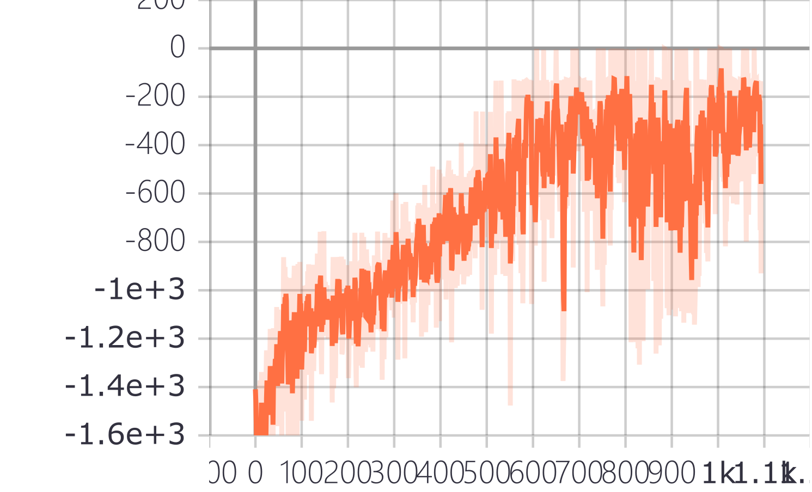

# ac-ppo
pytorch implementation Actor-Critic and openAI clipped PPO in gym cartpole-v0 and pendulum-v0 environment

# introduction
implement A2C and PPO in pytorch

# requirement 

- tensorflow (for tensorboard logging)
- pytorch (>=1.0, 1.0.1 used in my experiment)
- gym

# a2c

a2c in cartpole and pendulum, the training result shows below

result of a2c in cartpole-v0

result of a2c in pendulum-v0, it's quite hard for a2c converge in pendulum.. 

# ppo

result of ppo in pendulum-v0, somehow still hard to converge..don't know why, any one helps?

# ppo improved 

more efficient update with generalized advantage estimator (GAE) 